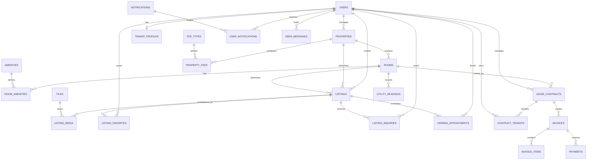

# Backend Express.js với TypeORM

Dự án backend sử dụng Express.js, TypeORM, và kiến trúc module với Dependency Injection.

## 🚀 Tính năng

- **Kiến trúc Module**: Cấu trúc code rõ ràng theo từng module
- **TypeScript**: Type-safe development
- **TypeORM**: ORM mạnh mẽ với MySQL
- **Inversify**: Dependency Injection container
- **JWT Authentication**: Xác thực với access token và refresh token
- **Zod Validation**: Validation mạnh mẽ cho input data
- **Error Handling**: Xử lý lỗi tập trung
- **Transaction Support**: Hỗ trợ database transactions

## 📁 Cấu trúc thư mục

```
src/
├── config/           # Cấu hình ứng dụng
├── database/         # Entities, schema helpers, seeders
├── modules/          # Các module nghiệp vụ
│   ├── auth/         # Module xác thực
│   ├── user/         # Module người dùng
│   └── comment/      # Module bình luận
├── shared/           # Code dùng chung
│   ├── base/         # Base classes
│   ├── middleware/   # Middleware
│   ├── types/        # Type definitions
│   └── utils/        # Utility functions
└── index.ts         # Entry point
```

## 🛠️ Cài đặt

1. **Clone repository**

   ```bash
   git clone <repository-url>
   cd backend-express-typeorm
   ```

2. **Cài đặt dependencies**

   ```bash
   npm install
   ```

3. **Cấu hình môi trường**

   ```bash
   cp .env.example .env
   ```

   Cập nhật file `.env` với thông tin database của bạn.

4. **Tạo database**

   ```bash
   mysql -u root -p
   CREATE DATABASE backend_db;
   ```

5. **Đồng bộ schema từ entities**

   ```bash
   npm run db:sync
   ```

6. **Seed dữ liệu ban đầu**
   ```bash
   npm run db:seed
   ```

## 🏃‍♂️ Chạy ứng dụng

### Development

```bash
npm run dev
```

### Production

```bash
npm run build
npm start
```

## 📚 API Documentation

### Authentication

#### Đăng ký

```http
POST /api/auth/register
Content-Type: application/json

{
  "email": "user@example.com",
  "password": "password123",
  "firstName": "John",
  "lastName": "Doe"
}
```

#### Đăng nhập

```http
POST /api/auth/login
Content-Type: application/json

{
  "email": "user@example.com",
  "password": "password123"
}
```

#### Lấy thông tin user hiện tại

```http
GET /api/auth/me
Cookie: access_token=<jwt_token>
```

#### Refresh token

```http
POST /api/auth/refresh
Cookie: refresh_token=<refresh_token>
```

#### Đăng xuất

```http
POST /api/auth/logout
Cookie: access_token=<jwt_token>
```

### Users

#### Lấy danh sách users

```http
GET /api/users?page=1&limit=10&search=john&isActive=true
Cookie: access_token=<jwt_token>
```

#### Lấy thông tin user

```http
GET /api/users/:id
Cookie: access_token=<jwt_token>
```

#### Cập nhật user

```http
PUT /api/users/:id
Content-Type: application/json
Cookie: access_token=<jwt_token>

{
  "firstName": "John Updated",
  "lastName": "Doe Updated"
}
```

### Comments

#### Lấy danh sách comments

```http
GET /api/comments?page=1&limit=10&userId=<user_id>
```

#### Tạo comment mới

```http
POST /api/comments
Content-Type: application/json
Cookie: access_token=<jwt_token>

{
  "content": "This is a comment",
  "parentId": "optional-parent-comment-id"
}
```

#### Cập nhật comment

```http
PUT /api/comments/:id
Content-Type: application/json
Cookie: access_token=<jwt_token>

{
  "content": "Updated comment content"
}
```

## 🔧 Scripts

- `npm run dev` - Chạy ở mode development
- `npm run build` - Build production
- `npm start` - Chạy production build
- `npm run db:sync` - Đồng bộ schema từ entities
- `npm run db:seed` - Seed dữ liệu

## 🗃️ Database Schema

### Users Table

- `id` (UUID, Primary Key)
- `email` (Unique)
- `password` (Hashed)
- `firstName`
- `lastName`
- `avatar` (Optional)
- `isActive` (Boolean)
- `refreshToken` (Optional)
- `createdAt`
- `updatedAt`

### Comments Table

- `id` (UUID, Primary Key)
- `content` (Text)
- `parentId` (Optional, Self-reference)
- `userId` (Foreign Key to Users)
- `isActive` (Boolean)
- `createdAt`
- `updatedAt`

## 🔐 Authentication

Ứng dụng sử dụng JWT với hai loại token:

- **Access Token**: Thời gian sống ngắn (15 phút), được gửi qua HTTP-only cookie
- **Refresh Token**: Thời gian sống dài (7 ngày), dùng để làm mới access token

## 🛡️ Security Features

- HTTP-only cookies cho tokens
- Password hashing với bcrypt
- CORS protection
- Helmet for security headers
- Input validation với Zod
- SQL injection protection với TypeORM

## 📦 Dependencies chính

- **Express.js**: Web framework
- **TypeORM**: Object-Relational Mapping
- **Inversify**: Dependency Injection
- **JWT**: JSON Web Tokens
- **Zod**: Schema validation
- **bcryptjs**: Password hashing
- **MySQL2**: MySQL driver

## Thiết kế database quản lý trọ

Phần database quản lý trọ hiện được thiết kế trong thư mục `src/database/models`. Giai đoạn này chỉ có entity và quan hệ dữ liệu; controller, service, route và migration sẽ làm ở các bước sau.

### 1. Khu trọ và phòng

#### `users`

Bảng tài khoản có sẵn. User có thể là chủ trọ, nhân viên quản lý hoặc người thuê.

#### `properties`

Lưu khu trọ hoặc tòa nhà.

- `ownerId` -> `users.id`: user sở hữu hoặc quản lý khu trọ.
- `code`: mã khu trọ.
- `name`: tên khu trọ.
- `addressLine`, `ward`, `district`, `province`: địa chỉ.
- `status`: khu trọ đang hoạt động hay tạm ngừng.

#### `rooms`

Lưu từng phòng thuộc khu trọ.

- `propertyId` -> `properties.id`: khu trọ chứa phòng.
- `code`: mã phòng, ví dụ `P101`.
- `floor`: tầng của phòng.
- `areaM2`: diện tích phòng.
- `maxOccupants`: số người tối đa.
- `rentPrice`: giá thuê cơ bản.
- `depositAmount`: tiền cọc.
- `status`: trống, đã giữ, đang thuê, bảo trì hoặc ngừng kinh doanh.
- `furnished`: phòng có nội thất hay không.

Quan hệ chính:

```text
users 1 --- n properties 1 --- n rooms
```

### 2. Tiện ích phòng

- `amenities`: danh mục tiện ích, ví dụ máy lạnh, máy giặt, WiFi.
- `room_amenities.roomId` -> `rooms.id`.
- `room_amenities.amenityId` -> `amenities.id`.

Đây là quan hệ nhiều-nhiều:

```text
rooms n --- n amenities
          qua room_amenities
```

### 3. Đăng tin cho thuê hoặc bán

#### `listings`

Lưu tin đăng trên hệ thống.

- `ownerId` -> `users.id`: user tạo tin.
- `propertyId` -> `properties.id`: đăng cả khu trọ.
- `roomId` -> `rooms.id`: đăng riêng một phòng.
- `type`: `rent` cho thuê hoặc `sale` bán.
- `title`, `slug`, `description`: nội dung tin.
- `price`: giá thuê hoặc giá bán.
- `status`: bản nháp, chờ duyệt, đã đăng, từ chối, hết hạn hoặc đóng tin.
- `publishedAt`, `expiresAt`: thời gian hiển thị tin.

Một tin chỉ liên kết với khu trọ hoặc phòng.

#### Các bảng liên quan

- `listing_media.listingId` -> `listings.id`: hình ảnh của tin.
- `listing_media.fileId` -> `files.id`: file đã upload.
- `listing_favorites.userId` -> `users.id`: user lưu tin.
- `listing_favorites.listingId` -> `listings.id`: tin được lưu.
- `listing_inquiries.userId` -> `users.id`: user gửi yêu cầu liên hệ.
- `listing_inquiries.listingId` -> `listings.id`: tin được hỏi.
- `viewing_appointments.userId` -> `users.id`: user đặt lịch xem.
- `viewing_appointments.listingId` -> `listings.id`: tin được đặt lịch.

### 4. Người thuê và hợp đồng

- `tenant_profiles.userId` -> `users.id`: thông tin giấy tờ và liên hệ khẩn cấp.
- `lease_contracts.roomId` -> `rooms.id`: phòng trong hợp đồng.
- `lease_contracts.landlordId` -> `users.id`: chủ trọ quản lý hợp đồng.
- `contract_tenants.contractId` -> `lease_contracts.id`: hợp đồng tham gia.
- `contract_tenants.userId` -> `users.id`: người thuê.

Một hợp đồng có thể có nhiều người thuê. Một phòng chỉ có một hợp đồng đang ở trạng thái `active`.

### 5. Phí, điện nước và thanh toán

- `fee_types`: loại phí, ví dụ điện, nước, WiFi, giữ xe.
- `property_fees.propertyId` -> `properties.id`: khu trọ áp dụng phí.
- `property_fees.feeTypeId` -> `fee_types.id`: loại phí.
- `utility_readings.roomId` -> `rooms.id`: chỉ số điện/nước theo kỳ.
- `invoices.contractId` -> `lease_contracts.id`: hóa đơn của hợp đồng.
- `invoice_items.invoiceId` -> `invoices.id`: tiền phòng, điện, nước, dịch vụ.
- `payments.invoiceId` -> `invoices.id`: các lần thanh toán.

Luồng tiền:

```text
lease_contracts
  -> utility_readings
  -> invoices
       -> invoice_items
       -> payments
```

### 6. Sơ đồ tổng quan



### 7. Thứ tự triển khai tiếp theo

1. Làm module `Property` và `Room`.
2. Làm module `Amenity` và liên kết tiện ích phòng.
3. Làm module `Listing` và upload hình ảnh.
4. Làm yêu thích, yêu cầu liên hệ và lịch xem.
5. Làm hồ sơ người thuê và hợp đồng.
6. Làm điện nước, hóa đơn và thanh toán.
7. Gắn notification vào từng sự kiện nghiệp vụ.

Chưa chạy đồng bộ database thật. Khi cần tạo bảng từ entity, dùng `npm run db:sync` sau khi kiểm tra lại cấu trúc.

## 🤝 Contributing

1. Fork repository
2. Tạo feature branch
3. Commit changes
4. Push to branch
5. Tạo Pull Request

## 📄 License

MIT License

## 🧪 Testing

### Chạy test tự động

```bash
./test-api.sh
```

### Test thủ công

Xem chi tiết trong [API_TESTING.md](./API_TESTING.md)

### Credentials mặc định sau khi seed

- **Email**: admin@example.com
- **Password**: password123

### Quick test endpoints

```bash
# Health check
curl http://localhost:4500/health

# Login
curl -c cookies.txt -X POST http://localhost:4500/api/v1/auth/login \
  -H "Content-Type: application/json" \
  -d '{"email": "admin@example.com", "password": "password123"}'

# Get profile
curl -b cookies.txt http://localhost:4500/api/v1/auth/me
```
